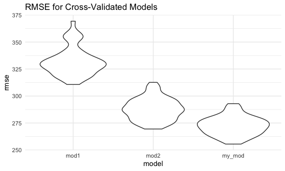

Homework 6
================
Saryu Patel
12/1/2021

``` r
library(tidyverse)
library(modelr)

knitr::opts_chunk$set(
  fig.width = 6,
  fig.asp = 0.6,
  out.width = "90%"
)
theme_set(theme_minimal())

options(
  ggplot2.continuous.colour = "viridis",
  ggplot2.continuous.fill = "viridis"
)

scale_colour_discrete = scale_colour_viridis_d
scale_fill_discrete = scale_fill_viridis_d
```

## Problem 1

### Data Cleaning

``` r
baby_df <- 
  read_csv("data/birthweight.csv") %>%
  mutate(babysex = as.factor(babysex),
         babysex = fct_recode(babysex, "male" = "1", "female" = "2"),
         frace = as.factor(frace),
         frace = fct_recode(frace, "white" = "1", "black" = "2", "asian" = "3", 
                       "puerto rican" = "4", "other" = "8"),
         malform = as.logical(malform),
         mrace = as.factor(mrace),
         mrace = fct_recode(mrace, "white" = "1", "black" = "2", "asian" = "3", 
                       "puerto rican" = "4"))
```

    ## Rows: 4342 Columns: 20

    ## ── Column specification ────────────────────────────────────────────────────────
    ## Delimiter: ","
    ## dbl (20): babysex, bhead, blength, bwt, delwt, fincome, frace, gaweeks, malf...

    ## 
    ## ℹ Use `spec()` to retrieve the full column specification for this data.
    ## ℹ Specify the column types or set `show_col_types = FALSE` to quiet this message.

There are 0 missing values.

### Propose a Model

Backward elimination will be used to determine an appropriate model,
with 0.05 as the threshold.

``` r
baby_lm1 <- lm(bwt ~ ., data = baby_df)
anova(baby_lm1)
```

    ## Analysis of Variance Table
    ## 
    ## Response: bwt
    ##             Df    Sum Sq   Mean Sq   F value    Pr(>F)    
    ## babysex      1   8547634   8547634  115.1324 < 2.2e-16 ***
    ## bhead        1 628838120 628838120 8470.1420 < 2.2e-16 ***
    ## blength      1 140213755 140213755 1888.6107 < 2.2e-16 ***
    ## delwt        1   8647158   8647158  116.4730 < 2.2e-16 ***
    ## fincome      1   4845845   4845845   65.2712 8.394e-16 ***
    ## frace        4  12713426   3178356   42.8109 < 2.2e-16 ***
    ## gaweeks      1   4500541   4500541   60.6201 8.605e-15 ***
    ## malform      1       529       529    0.0071  0.932737    
    ## menarche     1     51223     51223    0.6899  0.406230    
    ## mheight      1    535674    535674    7.2153  0.007256 ** 
    ## momage       1        51        51    0.0007  0.979114    
    ## mrace        3    682863    227621    3.0659  0.026879 *  
    ## parity       1    495627    495627    6.6759  0.009805 ** 
    ## ppbmi        1   2636579   2636579   35.5134 2.735e-09 ***
    ## ppwt         1    142438    142438    1.9186  0.166085    
    ## smoken       1   5076393   5076393   68.3765 < 2.2e-16 ***
    ## Residuals 4320 320724338     74242                        
    ## ---
    ## Signif. codes:  0 '***' 0.001 '**' 0.01 '*' 0.05 '.' 0.1 ' ' 1

`momage` has the highest p-value greater than 0.05, so it will be
removed.

``` r
baby_lm2 <- lm(bwt ~ . - momage, data = baby_df)
anova(baby_lm2)
```

    ## Analysis of Variance Table
    ## 
    ## Response: bwt
    ##             Df    Sum Sq   Mean Sq   F value    Pr(>F)    
    ## babysex      1   8547634   8547634  115.1488 < 2.2e-16 ***
    ## bhead        1 628838120 628838120 8471.3456 < 2.2e-16 ***
    ## blength      1 140213755 140213755 1888.8791 < 2.2e-16 ***
    ## delwt        1   8647158   8647158  116.4895 < 2.2e-16 ***
    ## fincome      1   4845845   4845845   65.2804 8.354e-16 ***
    ## frace        4  12713426   3178356   42.8170 < 2.2e-16 ***
    ## gaweeks      1   4500541   4500541   60.6287 8.568e-15 ***
    ## malform      1       529       529    0.0071  0.932733    
    ## menarche     1     51223     51223    0.6900  0.406197    
    ## mheight      1    535674    535674    7.2163  0.007252 ** 
    ## mrace        3    682319    227440    3.0639  0.026953 *  
    ## parity       1    490915    490915    6.6133  0.010155 *  
    ## ppbmi        1   2608754   2608754   35.1436 3.301e-09 ***
    ## ppwt         1    141608    141608    1.9077  0.167294    
    ## smoken       1   5081695   5081695   68.4577 < 2.2e-16 ***
    ## Residuals 4321 320752999     74231                        
    ## ---
    ## Signif. codes:  0 '***' 0.001 '**' 0.01 '*' 0.05 '.' 0.1 ' ' 1

`malform` has the highest p-value greater than 0.05, so it will be
removed.

``` r
baby_lm3 <- lm(bwt ~ . - momage - malform, data = baby_df)
anova(baby_lm3)
```

    ## Analysis of Variance Table
    ## 
    ## Response: bwt
    ##             Df    Sum Sq   Mean Sq   F value    Pr(>F)    
    ## babysex      1   8547634   8547634  115.1748 < 2.2e-16 ***
    ## bhead        1 628838120 628838120 8473.2613 < 2.2e-16 ***
    ## blength      1 140213755 140213755 1889.3062 < 2.2e-16 ***
    ## delwt        1   8647158   8647158  116.5159 < 2.2e-16 ***
    ## fincome      1   4845845   4845845   65.2952 8.292e-16 ***
    ## frace        4  12713426   3178356   42.8267 < 2.2e-16 ***
    ## gaweeks      1   4500541   4500541   60.6424 8.509e-15 ***
    ## menarche     1     51310     51310    0.6914  0.405742    
    ## mheight      1    535067    535067    7.2097  0.007279 ** 
    ## mrace        3    682439    227480    3.0652  0.026908 *  
    ## parity       1    490814    490814    6.6135  0.010154 *  
    ## ppbmi        1   2609609   2609609   35.1631 3.269e-09 ***
    ## ppwt         1    141634    141634    1.9084  0.167208    
    ## smoken       1   5080146   5080146   68.4523 < 2.2e-16 ***
    ## Residuals 4322 320754697     74214                        
    ## ---
    ## Signif. codes:  0 '***' 0.001 '**' 0.01 '*' 0.05 '.' 0.1 ' ' 1

`menarche` has the highest p-value greater than 0.05, so it will be
removed.

``` r
baby_lm4 <- lm(bwt ~ . - momage - malform - menarche, data = baby_df)
anova(baby_lm4)
```

    ## Analysis of Variance Table
    ## 
    ## Response: bwt
    ##             Df    Sum Sq   Mean Sq   F value    Pr(>F)    
    ## babysex      1   8547634   8547634  115.1674 < 2.2e-16 ***
    ## bhead        1 628838120 628838120 8472.7154 < 2.2e-16 ***
    ## blength      1 140213755 140213755 1889.1845 < 2.2e-16 ***
    ## delwt        1   8647158   8647158  116.5084 < 2.2e-16 ***
    ## fincome      1   4845845   4845845   65.2910 8.309e-16 ***
    ## frace        4  12713426   3178356   42.8239 < 2.2e-16 ***
    ## gaweeks      1   4500541   4500541   60.6385 8.525e-15 ***
    ## mheight      1    485434    485434    6.5405   0.01058 *  
    ## mrace        3    674204    224735    3.0280   0.02830 *  
    ## parity       1    480632    480632    6.4758   0.01097 *  
    ## ppbmi        1   2597580   2597580   34.9988 3.554e-09 ***
    ## ppwt         1    147704    147704    1.9901   0.15840    
    ## smoken       1   5110580   5110580   68.8579 < 2.2e-16 ***
    ## Residuals 4323 320849582     74219                        
    ## ---
    ## Signif. codes:  0 '***' 0.001 '**' 0.01 '*' 0.05 '.' 0.1 ' ' 1

`ppwt` has the highest p-value greater than 0.05, so it will be removed.

``` r
baby_lm5 <- lm(bwt ~ . - momage - malform - menarche - ppwt, data = baby_df)
anova(baby_lm5)
```

    ## Analysis of Variance Table
    ## 
    ## Response: bwt
    ##             Df    Sum Sq   Mean Sq   F value    Pr(>F)    
    ## babysex      1   8547634   8547634  115.1674 < 2.2e-16 ***
    ## bhead        1 628838120 628838120 8472.7154 < 2.2e-16 ***
    ## blength      1 140213755 140213755 1889.1845 < 2.2e-16 ***
    ## delwt        1   8647158   8647158  116.5084 < 2.2e-16 ***
    ## fincome      1   4845845   4845845   65.2910 8.309e-16 ***
    ## frace        4  12713426   3178356   42.8239 < 2.2e-16 ***
    ## gaweeks      1   4500541   4500541   60.6385 8.525e-15 ***
    ## mheight      1    485434    485434    6.5405   0.01058 *  
    ## mrace        3    674204    224735    3.0280   0.02830 *  
    ## parity       1    480632    480632    6.4758   0.01097 *  
    ## ppbmi        1   2597580   2597580   34.9988 3.554e-09 ***
    ## smoken       1   5122929   5122929   69.0243 < 2.2e-16 ***
    ## wtgain       1    135354    135354    1.8237   0.17694    
    ## Residuals 4323 320849582     74219                        
    ## ---
    ## Signif. codes:  0 '***' 0.001 '**' 0.01 '*' 0.05 '.' 0.1 ' ' 1

`wtgain` has the highest p-value greater than 0.05, so it will be
removed.

``` r
baby_lm6 <- lm(bwt ~ . - momage - malform - menarche - ppwt - wtgain,
               data = baby_df)
anova(baby_lm6)
```

    ## Analysis of Variance Table
    ## 
    ## Response: bwt
    ##             Df    Sum Sq   Mean Sq   F value    Pr(>F)    
    ## babysex      1   8547634   8547634  115.1455 < 2.2e-16 ***
    ## bhead        1 628838120 628838120 8471.1017 < 2.2e-16 ***
    ## blength      1 140213755 140213755 1888.8247 < 2.2e-16 ***
    ## delwt        1   8647158   8647158  116.4862 < 2.2e-16 ***
    ## fincome      1   4845845   4845845   65.2786 8.361e-16 ***
    ## frace        4  12713426   3178356   42.8158 < 2.2e-16 ***
    ## gaweeks      1   4500541   4500541   60.6270 8.574e-15 ***
    ## mheight      1    485434    485434    6.5393   0.01059 *  
    ## mrace        3    674204    224735    3.0274   0.02833 *  
    ## parity       1    480632    480632    6.4746   0.01098 *  
    ## ppbmi        1   2597580   2597580   34.9921 3.566e-09 ***
    ## smoken       1   5122929   5122929   69.0112 < 2.2e-16 ***
    ## Residuals 4324 320984936     74233                        
    ## ---
    ## Signif. codes:  0 '***' 0.001 '**' 0.01 '*' 0.05 '.' 0.1 ' ' 1

The remaining predictors are all significant at the 0.05 level, so they
will remain in the model.

The proposed model is
`bwt ~ babysex + bhead + blength + delwt + fincome + frace + gaweeks + mheight + mrace + parity + ppbmi + smoken`.

### Residuals vs. Fits

``` r
baby_df %>% 
  add_predictions(baby_lm6) %>% 
  add_residuals(baby_lm6) %>% 
  ggplot(aes(x = pred, y = resid)) +
  geom_point(alpha = 0.3) +
  labs(title = "Residuals vs. Fits")
```


### Model Comparison

``` r
set.seed(21)
cv_df <- 
  crossv_mc(baby_df, 100) %>% 
  mutate(
    train = map(train, as_tibble),
    test = map(test, as_tibble),
    my_mod = map(train, ~lm(bwt ~ . - momage - malform - menarche - ppwt - wtgain,
                              data = .x)),
    mod1 = map(train, ~lm(bwt ~ blength + gaweeks,
                          data = .x)),
    mod2 = map(train, ~lm(bwt ~ bhead + blength + babysex + bhead*blength +
                            bhead*babysex + blength*babysex +
                            bhead*blength*babysex, 
                          data = .x)),
    rmse_my_mod = map2_dbl(my_mod, test, ~rmse(model = .x, data = .y)),
    rmse_mod1 = map2_dbl(mod1, test, ~rmse(model = .x, data = .y)),
    rmse_mod2 = map2_dbl(mod2, test, ~rmse(model = .x, data = .y))
  )
```

``` r
cv_df %>% 
  select(starts_with("rmse")) %>% 
  pivot_longer(
    everything(),
    names_to = "model",
    values_to = "rmse",
    names_prefix = "rmse_"
  ) %>% 
  ggplot(aes(x = model, y = rmse)) +
  geom_violin() +
  labs(title = "RMSE for Cross-Validated Models")
```



``` r
cv_df %>% 
  select(starts_with("rmse")) %>% 
  pivot_longer(
    everything(),
    names_to = "model",
    values_to = "rmse",
    names_prefix = "rmse_"
  ) %>% 
  group_by(model) %>% 
  summarize(avg_rmse = mean(rmse)) %>% 
  knitr::kable()
```

| model   | avg\_rmse |
|:--------|----------:|
| mod1    |  332.1239 |
| mod2    |  287.8229 |
| my\_mod |  272.4801 |

Visually, based on the violin plot, we can see that the proposed model
and model 2 have smaller RMSE than model 1. The average RMSE for the
proposed model is the smallest, although model 2 comes in close second.

## Problem 2

### Import data

``` r
weather_df <-  
  rnoaa::meteo_pull_monitors(
    c("USW00094728"),
    var = c("PRCP", "TMIN", "TMAX"), 
    date_min = "2017-01-01",
    date_max = "2017-12-31") %>%
  mutate(
    name = recode(id, USW00094728 = "CentralPark_NY"),
    tmin = tmin / 10,
    tmax = tmax / 10) %>%
  select(name, id, everything())
```

### Bootstrapping

``` r
boot_models <- 
  weather_df %>% 
  bootstrap(5000, id = "strap_number") %>% 
  mutate(
    models = map(strap, ~lm(tmax ~ tmin, data = .x)),
  )
```

### Estimates

#### Examine R-Squared

``` r
r_sq <- 
  boot_models %>% 
  mutate(results = map(models, broom::glance)) %>% 
  select(strap_number, results) %>% 
  unnest(results) %>% 
  select(strap_number, r.squared)
```

Plot the distribution:

``` r
r_sq %>% 
  ggplot(aes(x = r.squared)) +
  geom_density() +
  labs(title = "Distribution of R-Squared")
```


The mean R-squared value is about 0.91, and it ranges from 0.88 to 0.94.
The distribution appears to be approximately Normal.

Confidence interval for R-squared:

``` r
r_sq_conf <- 
  r_sq %>% 
  summarize(
    ci_lower = quantile(r.squared, 0.025),
    ci_upper = quantile(r.squared, 0.975)
  )
```

We are 95% confident that the true mean R-squared value lies between
0.89 and 0.93.

#### Examine log (*β̂*<sub>0</sub> \* *β̂*<sub>1</sub>)

``` r
beta_hats <- 
  boot_models %>% 
  mutate(results = map(models, broom::tidy)) %>% 
  select(strap_number, results) %>% 
  unnest(results) %>% 
  select(strap_number, term, estimate) %>% 
  pivot_wider(names_from = term,
              values_from = estimate) %>% 
  rename(intercept = "(Intercept)") %>% 
  mutate(log_beta_hats = log(intercept * tmin))
```

Plot the distribution:

``` r
beta_hats %>% 
  ggplot(aes(x = log_beta_hats)) +
  geom_density() +
  labs(title = "Distribution of log(B_hat_0*B_hat_1)")
```


The mean log (*β̂*<sub>0</sub> \* *β̂*<sub>1</sub>) value is about 2.01,
and it ranges from 1.9 to 2.09. The distribution appears to be
approximately Normal.

Confidence interval for log (*β̂*<sub>0</sub> \* *β̂*<sub>1</sub>):

``` r
log_betas_conf <- 
  beta_hats %>% 
  summarize(
    ci_lower = quantile(log_beta_hats, 0.025),
    ci_upper = quantile(log_beta_hats, 0.975)
  )
```

We are 95% confident that the true mean
log (*β̂*<sub>0</sub> \* *β̂*<sub>1</sub>) lies between 1.96 and 2.06.
